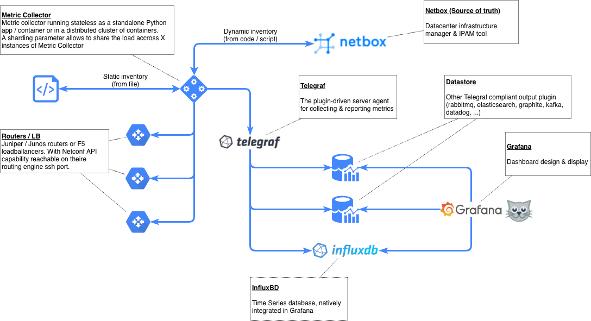

  

## Py-metric-collector

The **Py Metric Collector** is a tool to collect information in Junos devices over Netconf.  
This tool was initially part of OpenNTI, the goal of this project is to create a standalone version.

## Features

-  Supports Junos via Netconf and F5 Devices via iControl REST API
-  Scheduler support: Periodic data collection and dumping to influxdb via telegraf

## Architecture

Py Metric Collector is a long lived process with it's internal scheduler that bridges a dynamic (or static) inventory with Telegraf.


## Give it a try

You will need a running docker host and docker-compose to launch the test stack.

### Define your devices parameters
Initialize `lab-xxx-hosts.yaml` & `lab-xxx-credentials.yaml` with the information corresponding to your device
Credentials and hosts file must be in "quickstart" folder. File starting with "lab" are .gitignored to prevent you from leaking sensible topology or security informations.

#### Hosts files
File format will be :
```
device1:
  tags: [ junos, router ]
  address: 192.168.0.1
  context:
    - site: sitea
    - role: router

device2:
  tags: [ junos, switch ]
  address: 192.168.0.2
  context:
    - site: siteb
    - role: switch

device3:
  tags: [ junos ]
  address: 192.168.0.3
```

Keep in mind that `tags` are going to make the glue between hosts files, credentials and commands files.

#### Credentials files
If you use ssh key based authentication, use this format :
```
lab_credentials:
    username: root
    method: key
    key_file: keys/private-key
    tags: juniper
```

If you use user and password, use this format :
```
lab_credentials:
    username: root
    password: <password>
    method: password
    tags: juniper
```

#### Commands files
Commands are stored in a specific file. A sample can be found at [`commands.yaml`](quickstart/commands.yaml)
A specific interval in seconds can be defined for a group of commands.
It is formated like this :
```
# GENERIC COMMANDS

generic_commands:
   commands: |
      show route summary
      show interfaces extensive
   tags: junos

mpls_commands_1m:
   commands:
      show mpls lsp ingress statistics detail
   tags: [ border-router ]
   interval: 60

# Do not remove this three dashes (“---”) they are used to separate documents
---
```

### Launch the docker-compose stack

Pass the hosts, and credentials through ENV variables at the runtime so they keep safe

```
% CREDENTIALS=lab0-credentials.yaml HOSTS=lab0-hosts.yaml docker-compose up
```

### Open Grafana  

Open a browser and go to http://0.0.0.0:3000, use "admin / admin " as login / password and you can start building nice dashboards.
